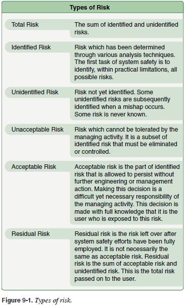

# The Teaching Process

1. Preparation of a lesson
    * Steps of teaching process (**PPAR**)
        * **Preparation**
        * **Presentation**
            * Demonstrator / performance method - instructor demonstrates, learner attempts
            * Lecture method
        * **Application**
            * Learner does it themselves
        * **Review/Evaluation/Assessment**
            * Should be an integral part of each lesson
            * Should be based on objectives and goals established in lesson plan
2. Organization of material
    * Instructors job is to help student learn, make associations and gain insight
    * Lessons should be sequenced to help learner achieve desired outcome
    * Show relationships between main points that will be presented in the lesson
    * Parts of lesson introduction (**AMO**)
        * **Attention** - about focusing learner on new subject
        * **Motivation** - show need for new motivation
        * **Overview** - what will be covered
3. Training delivery methods (**LGD CDC**)
    a. **Lecture method**
        * Most economical in terms of time
        * Effective at showing relationships between theory and practice
        * Teaching leacture - needs keen perception on part of instructor to determine of learner is actually learning the material
        * Lecture methods
            * Reading material
            * Illustrated talk (visual aids)
            * Briefing (concise facts, no elaboration)
            * Teaching/formal (inform, persuade, entertain)
                * Little to no participation from learner
        * First establish desired objective and outcome
        * **Informal lecture**
            * Has learner participation
            * Participation best encouraged with questions
            * Set tone with friendly and relaxed atmosphere so people feel comfortable to participate
    b. **Guided discussion method**
        * Lead with leadoff overhead question (usually begin with how? or why?)
        * Learner level of topic knowledge
        * Learning is achieved through the skillful use of questions
        * Guided discussion questions (**ORDRR**)
            * **Overhead**
                * Directed toward the entire class rather than an individual learner
                * Does not require a specific answer
                * Centers the thoughts of the entire class around the subject being taught
            * **Rhetorical**
                * Asked for a purpose other than to obtain the information the question asks
                * Asked to stimulate group thought
                * Normally answered by the instructor, it is more commonly used in lecturing rather than in guided discussions
            * **Direct**
                * A question used for follow-up purposes, but directed at a specific individual.
            * **Reverse**
                * Used in response to a learner's question
                * Rather than give a direct answer to the learner's query, the instructor returns the question to the same individual to provide the answer.
            * **Relay**
                * Used in response to a learner's question, the question is redirected to another individual.
    c. **Demonstration-performance method**
        * Students learn by trying under supervision
        * Include description of skill, conditions, and standards with which it needs to be complete
        * Five essential steps (**EDLIE**)
            * **Explanation**
            * **Demonstration**
            * **Learner (or student) performance**
            * **Instructor supervision**
            * **Evaluation**
    d. **Computer-assisted learning method**
        * One advantage less time is spent on traditional ground school and can spend more time on integration and correlation of learning
        * It's self paced
        * Interactive and can respond to learner inputs
    e. **Drill and practice method**
    f. **Cooperative / Group Learning**
        * Heterogeneous groups
        * Greater interaction and achievement
        * Greater success of learners than if they learn alone
        * Instructor gives instructions and then lets learners interact
4. Problem based learning
5. Instruction aids and training technologies
    * Instructional aids
        * Devices to assist you and learner in the process
        * Cover key points
        * Support point in lesson and lesson objective

# Techniques of Flight Instruction

1. Obstacles in learning during flight instruction (**AIWA PU**)
    * **A** - Anxiety
    * **I** - Impatience
    * **W** - Worry (lack of interest)
    * **A** - Apathy (due to inadequate instruction)
    * **P** - Physical Discomfort (illness, fatigue, dehydration)
    * **U** - Unfair treatment (feelings of)
2. Demonstration-performance training delivery
    * Four steps
        * Explanation
        * Demonstration
        * Learner performance and instruction supervision
        * Evaluation
    * Telling and doing technique
        * Instructor tells, instructor does
        * Learner tells, instructor does
        * Learner tells, learner does
        * Learner does, instructor evaluates
3. Positive exchange of controls
    * There should always be a clear understanding between learners and flight instructors about who has control of the aircraft
    * Use 3-way exhange
    * Verify visually after an exchange that it has occurred
    * Flight instructors should always guard the controls and be prepared to take control of the aircraft.
4. Sterile cockpit
    * Refrain from nonessential activities during critical phases of flight
    * This includes
        * Taxi
        * Takeoff
        * Landing
        * All other flight operations below 10,000 feet except cruise flight
5. Use of distractions
    * Most stall/spin accidents occurred when the pilot's attention was diverted from the primary task of flying the aircraft
    * Make sure learners develop the ability to cope with distractions while maintaining the degree of aircraft control required for safe flight
    * Many example distractions including
        * Dropping pencil and asking learner to pick it up
        * Determine heading to an airport using a chart
        * Reset the clock
6. Integrated flight instruction
    * Learner uses both outside visual references and instruments
    * Develops habit patterns of observance and reliance on instruments
    * The instructor must be sure the learner develops the habit of looking for other traffic
7. Assessment of piloting ability
    * Determine how, what, and how well a learner is learning
    * Should provide constructive feedback to learner
8. Aeronautical decision making
    * Start teaching ADM as soon as the student has the ability to control the aircraft
    * Dangerous behavior patterns to watch out for
        * Giving in to peer pressure
        * Scud running
        * Loss of situational awareness
        * Operating with inadequate fuel reserves

 [Chapter 9: Techniques of Flight Instruction](https://www.faa.gov/sites/faa.gov/files/regulations_policies/handbooks_manuals/aviation/aviation_instructors_handbook/11_aih_chapter_9.pdf) Figure 9-6.](../../../img/aih/aih-figure-9-6-demonstration-performance-method.jpg){width=3.4in}

 [Chapter 9: Techniques of Flight Instruction](https://www.faa.gov/sites/faa.gov/files/regulations_policies/handbooks_manuals/aviation/aviation_instructors_handbook/11_aih_chapter_9.pdf) Figure 9-7.](../../../img/aih/aih-figure-9-7-telling-and-doing-comparision.jpg){width=4in}

# Aeronautical Decision Making

* **Aeronautical Decision Making (ADM)**
  * A systematic approach to risk assessment and stress management.
  * Or, a systematic approach to mental process to determine best course of action in response to circumstances
* **Risk management** - identify and mitigate hazards
  * Relies on situational awareness
  * Problem recognition
  * Exercise good judgement
* **Judgement**
  * The mental process of recognizing and analyzing pertinent information
  * Evaluation of alternative actions in response
  * Timely decisions
* **Single Pilot Resource Management (SRM)** - the art and science of managing all the resources available to a single pilot to ensure the successful outcome of the flight.
* **Risk** - assessment of the single or cumulative hazard facing a pilot. Different pilots see hazards differently.
* **Situational Awareness** - the accurate perception of the operating and environmental factors that affect the aircraft, pilot, and passengers during a specified period of time.
* **Four Factors of Risk Management**
    1. Accept no unnecessary risk
    2. Decisions should be made by PIC, not ATC or passengers
    3. Accept risk when benefit outweighs danger
    4. Integrate risk management into planning at all levels
* **Five Hazardous Attitudes**
    1. Antiauthority *(don't tell me)*
        * *Follow the rules - they are usually right*
    2. Impulsivity *(do something quickly)*
        * *Not so fast. Think first.*
    3. Invulnerability *(it won't happen to me)*
        * *It could happen to me.*
    4. Macho *(I can do it)*
        * *Taking chances is foolish.*
    5. Resignation *(what's the use)*
        * *I'm not helpless. I can make a difference.*
* **Steps for good decision making are:**
  * Identifying personal attitudes hazardous to safe flight
  * Learning behavior modification techniques
  * Learning how to recognize and cope with stress
  * Developing risk assessment skills
  * Using all resources in a multicrew situation
  * Evaluating the effectiveness of one's ADM skills
* First step towards good ADM is recognizing hazardous attitudes
* To gain realistic perspective of your own hazardous attitudes, take a self assessment hazardous attitude inventory test.
* **Stress** - nonspecific generalized response to demands, whether pleasant or unpleasant
  * Reduce stress in personal life first
  * At first sign of stress in cockpit just relax and think rationally

# Risk Management

1. Principles of risk management
    * The function of risk management is a decision making process designed to identify hazards systematically
2. Risk management process
3. Level of risk
4. Assessing risk
5. Mitigating risk
6. **IMSAFE** personal checklist
    * ==**I** - **Illness**==
    * ==**M** - **Medication**==
    * ==**S** - **Stress**==
    * ==**A** - **Alcohol**==
    * ==**F** - **Fatigue**==
    * ==**E** - **Eating**==
7. PAVE checklist
    * ==*Use the* ***PAVE checklist*** *to perceive hazards*==
    * Identify hazards and personal minimums
    * Divides risk into four fundamental risk elements or categories
        * ==**P** ilot==
        * ==**A** ircraft==
        * ==en **V** ironment==
        * ==**E** xternal pressures (mission)==
8. 5P checklist
    * The **5P concept** relies on the pilot to adopt a "scheduled" review of the critical variables at points in the flight where decisions are most likely to be effective.
    * *Apply the* ***5 Ps*** *to evaluate the pilot's current situation at key decision points during the flight or when an emergency arises.*
        1. **P** lan
        2. **P** lane
        3. **P** ilot
        4. **P** assengers
        5. **P** rogramming

        > The 5 Ps are used to evaluate the pilot's current situation at key decision points during the flight, or when an emergency arises. These decision points include preflight, pretakeoff, hourly or at the midpoint of the flight, predescent, and just prior to the final approach fix or for visual flight rules (VFR) operations, just prior to entering the traffic pattern.

## Three models of a structured framework for decision-making

### 1. 5 Ps

* *Apply the* ***5 Ps*** *to evaluate the pilot's current situation at key decision points during the flight or when an emergency arises.*
* The 5P concept relies on the pilot to adopt a "scheduled" review of the critical variables at points in the flight where decisions are most likely to be effective.
    1. **P** lan
    2. **P** lane
    3. **P** ilot
    4. **P** assengers
    5. **P** rogramming

### 2. 3P using: PAVE, CARE and TEAM

PAEM sometimes used instead of PAVE where the M is for mission.

1. **Perceive** - given circumstances
    * *Use the* ***PAVE checklist*** *to perceive hazards*
    * Identify hazards and personal minimums
    * Divides risk into four fundamental risk elements or categories
      * **P** ilot
      * **A** ircraft
      * en **V** ironment
      * **E** xternal pressures (mission)
2. **Process** - impact on flight safety
    * *Use the* ***CARE checklist*** *to process hazards*
    * Review hazards and evaluate risk
      * **C** onsequences
      * **A** lternatives
      * **R** eality
      * **E** xternal factors
3. **Perform** - implement best course of action
    * *Use the* ***TEAM checklist*** *to choose and implement risk control*
    * Take action to eliminate hazards or mitigate risk
      * **T** ransfter
      * **E** liminate
      * **A** ccept
      * **M** itigate

### 3. DECIDE

*The* ***DECIDE Model*** *is a continuous loop to make decisions*

* **D** - Detect
  * A change
* **E** - Estimate
  * Need to react
* **C** - Choose
  * Desirable outcome
* **I** - Identify
  * Actions needed
* **D** - Do
  * The actions
* **E** - Evaluate
  * The effect

## Key takeaways from ADM

1. Decisions should be made proactively, not reactively (e.g. 5P's)
2. Feedback should be used throughout the decision making process (e.g. DECIDE)
3. All risk factors must be considered (e.g. PAVE)

## Types of Risk

{width=3.4in}

## Examples

* Consider flying a type 135 (charter) operation and an executive wants to get on the plane clearly intoxicated. By [14 CFR &sect;91.17 - Alcohol or drugs](https://www.ecfr.gov/current/title-14/chapter-I/subchapter-F/part-91/subpart-A/section-91.17) we cannot legally fly, so an option in this case is to blame inability to fly on aircraft problem.
* Consider flying in a two-pilot aircraft as SIC and the PIC wants to do something reckless. To avoid this from happening without a potential confrontation, As SIC just call ATC and state intentions, e.g. request 20 degrees right to avoid thunderstorm.

# References

* [FAA-H-8083-9B Aviation Instructor's Handbook](https://www.faa.gov/regulations_policies/handbooks_manuals/aviation/aviation_instructors_handbook)
    * [Chapter 1: Risk Management and Single-Pilot Resource Management](https://www.faa.gov/sites/faa.gov/files/regulations_policies/handbooks_manuals/aviation/aviation_instructors_handbook/03_aih_chapter_1.pdf)
  * [Chapter 5: The Teaching Process](https://www.faa.gov/sites/faa.gov/files/regulations_policies/handbooks_manuals/aviation/aviation_instructors_handbook/07_aih_chapter_5.pdf)
  * [Chapter 9: Techniques of Flight Instruction](https://www.faa.gov/sites/faa.gov/files/regulations_policies/handbooks_manuals/aviation/aviation_instructors_handbook/11_aih_chapter_9.pdf)
